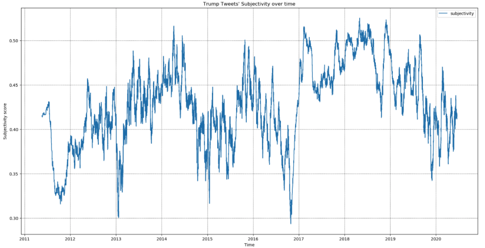
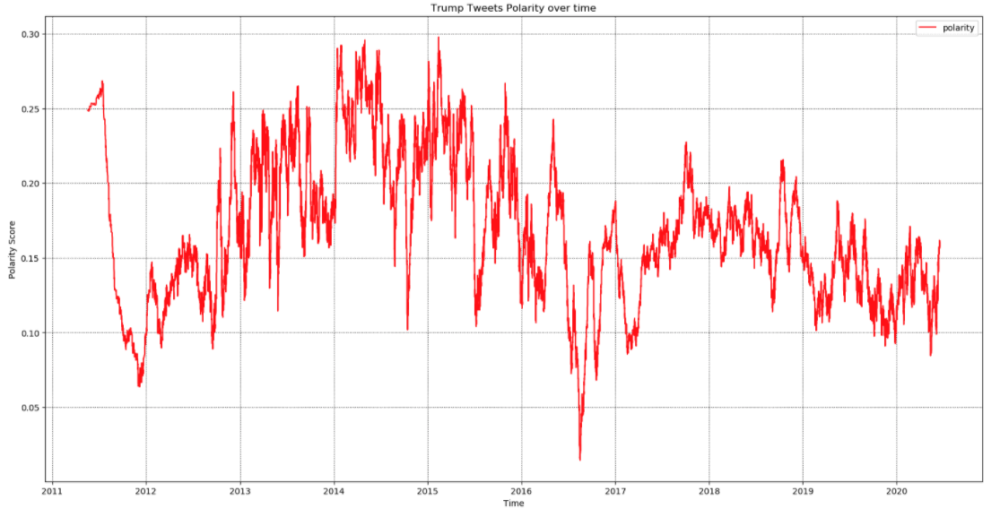
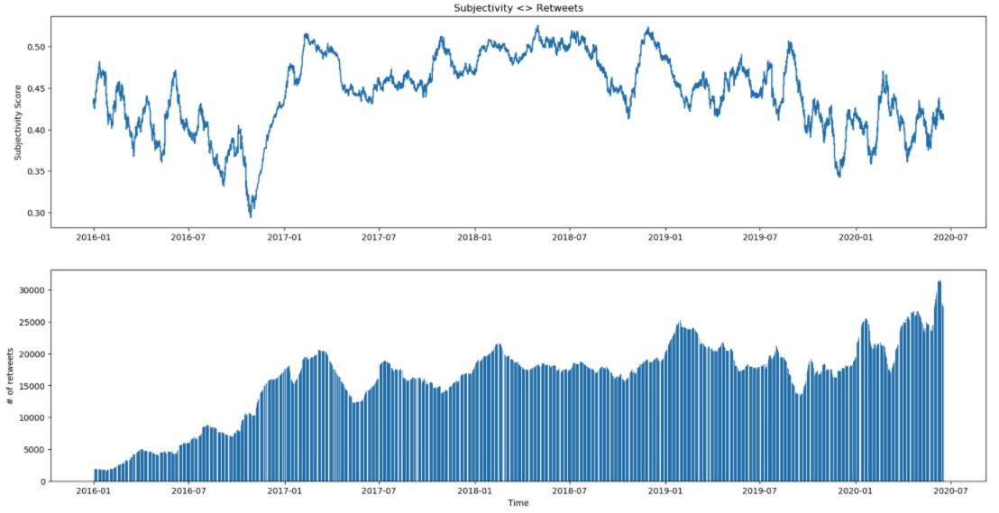
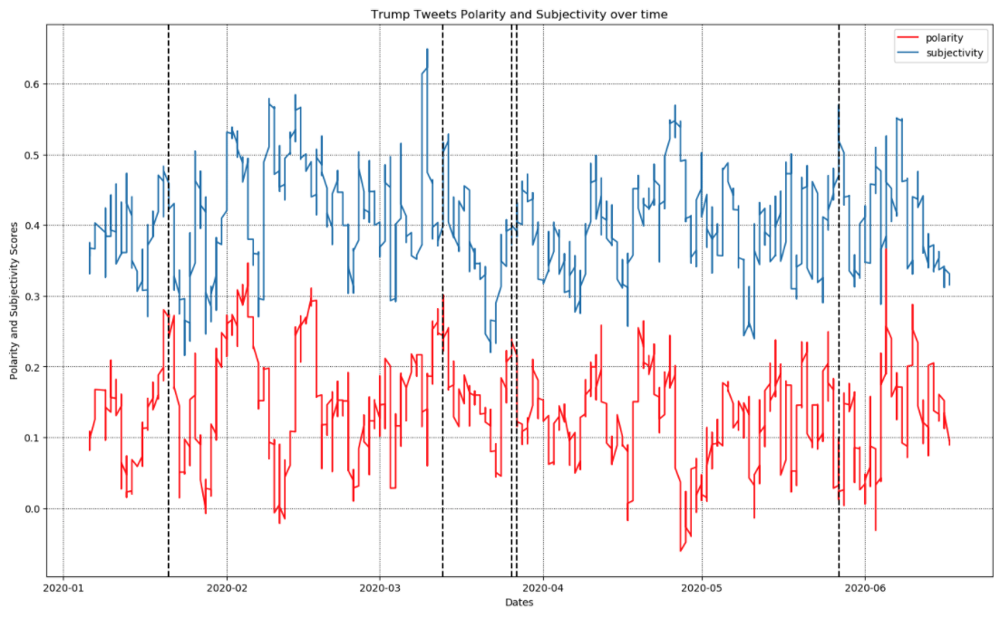

# Sentiment Analysis of Trump's Tweets

tl;dr We used TextBlob to analyze about 43k tweets made by Donald Trump. We present the subjectivity and polarity over time and showcase specific events.
## Introduction
Donald J Trump, the 45th president of the United States of America, has been the first president to widely use Twitter as a means to reach the masses. Since posting a tweet does not require fact checking or screening of any sort, Donald Trump has the freedom to share what he wants, when he wants. Within the last year, the development of the coronavirus shed brighter light on this matter. Donald Trump was accused to share misinformation about viable medication and other means of preventing and curing the coronavirus. Due to that, he has seen criticism from republicans and democrats all over the country. Twitter itself started labeling Trump’s tweets with a warning so his followers can take it upon themselves to check the facts before blindly consuming.
In this paper, we take a look over the last 43,000 tweets made by Donald Trump. We use semantic analysis software to measure the subjectivity and polarity of each tweet and present them in a manner that showcases how much of an influence Trump’s opinions have on what he posts on twitter. Moreover, we will highlight what events we see spikes in subjectivity and in what events we see drastic falls in subjectivity. Lastly, we will try to explain the reasoning behind the movements and explain any correlations we notice.

## The dataset
We turned to [Kaggle](https://www.kaggle.com/austinreese/trump-tweets), an online data sourcing platform, to provide us with the data we then analysed. The dataset contained tweets sent by twitter account ```@realdonaldtrump```, which is owned and operated by President Donald Trump. The dataset contained 7 columns: **id** a number value used to uniquely identify a tweet, **link** which is a string value containing a url to reach the tweet, **content** which is a string value containing the text of the tweet, **date** which is a string value containing the date the tweet was posted along with the hour, minute, and second the tweet was published, **retweets** which is a number value for the number of retweets the tweet got, **favorites** which is a number value signaling the number of favorites the tweet got, **mentions** which is the string with all @ mentions in the tweet, and **hashtags** which is string with all the hashtags in the tweet. The dataset contained 43352 rows. Below is a summary statistics of the dataset:

Out of the seven columns, only three were useful to us: date, tweet, and retweet. Using these three, we create a new table. Here are the columns of our new table:
  * Date: we took the date column from the original table and stripped the time component of it. Our date variable has YYYY-MM-DD for each tweet
  * Time: we took the time component from the date column of the original dataset
  * Tweet: we took the original tweets and removed any @ mentions and links to get a new string with content made by Trump himself
  * Retweet: we didn't touch this variable.
  * Subjectivity: a score from 0 to 1 describing how subjective a string is. 0 being not subjective at all and 1 being very subjective. We’ll talk more      about this later
  * Polarity: a score from -1 to 1. -1 meaning very negatively polar, 1 meaning very positively polar, and 0 meaning neutral. More on this later.

## Libraries
In order to get polarity and subjectivity scores, we used [TextBlob](https://textblob.readthedocs.io/en/dev/quickstart.html#sentiment-analysis). TextBlob is a famous sentiment analysis tool available as a python library. For a given string, it predicts the polarity and subjectivity for the constituent words. Polarity is ranged from -1 to 1 where -1 signals negative polarity and 1 signals positive polarity. A word like “worst” will receive -1, “best” will receive 1, and “library” will receive 0. The polarity of a sentence is the average of the constituent words. The subjectivity score is ranged from 0 to 1 where 0 is not subjective and 1 is very subjective. A sentence like “that’s a very great idea” will receive a subjectivity score close to 1 while the statement “sun rises due east” will receive subjectivity score of 0. TextBlob’s subjectivity score, however, cannot be used to judge correctness of a string: the phrase “sun rises due west” also gets a subjectivity score of 0 even though it is false.
We used TextBlob to get the subjectivity and polarity scores for Trump’s tweets as mentioned above. Although TextBlob allows multiple sentence consumption, we passed Trump's tweets one by one so they don’t influence the results of one another. We used this data in our analysis below.

## Sentiment Analysis
Below are the graphs demonstrating the change in both polarity and subjectivity of the tweets since May 2009 to June 2020. On both scores we used [moving averages](https://en.wikipedia.org/wiki/Moving_average) to smooth out all the short time variations. However, using moving averages also takes away extreme values of both sentiments. Hence, we see a small range of the polarity and subjectivity scores. Below is a graph of our sentiment scores over time.





In both graphs we see heightened drops and rises late 2016 and early 2017 which was around the election and the presidential transition periods. This makes sense as that would be the time that Donald Trump was alternating between supporting his side and discrediting the democrats.

Next, we wanted to check if the subjectivity of Trump's tweets had any correlation with the number of retweets from his followers. It is clear with the figure below that on average the more subjective tweets had a higher retweet counts.



Last, we solely focused on 2020 which was an unprecedented year in general but even more so in the political landscape. The months that led up to the elections were filled with polarized opinions from both political parties, and [COVID-19 pandemic](https://en.wikipedia.org/wiki/Coronavirus) did nothing but heighten that polarization.



The key dates marked are according to [ABC News](https://abcnews.go.com/Health/timeline-coronavirus-started/story?id=69435165). When the 1st case of COVID-19 was confirmed in the US, when Donald Trump declared national emergency, when the US led the world in COVID-19 cases, when Trump signed the $2 trillion stimulus bill, and when the deaths due to COVID-19 reached 100,000 respectively. From the figure we can see for instance how around the time the 1st case was registered and Donald Trump’s tweets had a high positive polarity and subjectivity score.

## Conclusion

Sentiment analysis is an important tool that can help in many areas. We did our analysis on Donald Trump tweets, but this analysis can be used in so many other avenues. Businesses can use it to track the sentiment of their customers regarding their product or brand and make changes accordingly. For such an analysis, however, one needs some form of natural language data. One of the accessible sources of such data is the [Twitter API](https://developer.twitter.com/en/docs) that gives access to its public data.

As our next step, we would like to do more sentiment analysis using other packages such as the [BERTmoticon package](https://pypi.org/project/bertmoticon/) that gives a broader range of sentiment based on [the Plutchik wheel of emotions](https://en.wikipedia.org/wiki/Robert_Plutchik). 

We would like to express our gratitute to [Professor Mike Izbicki](https://izbicki.me/) for providing guidance and support throughout this project.
